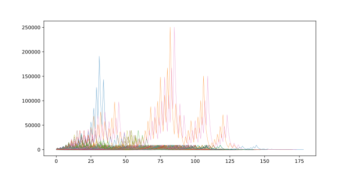
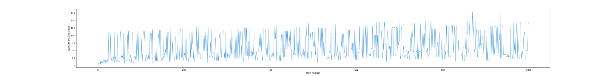
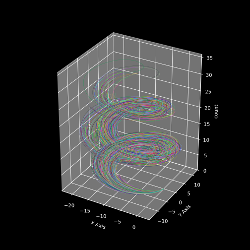
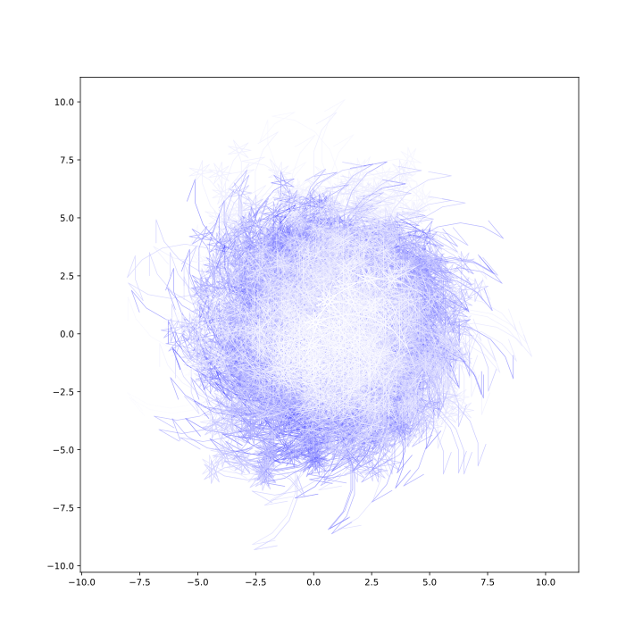
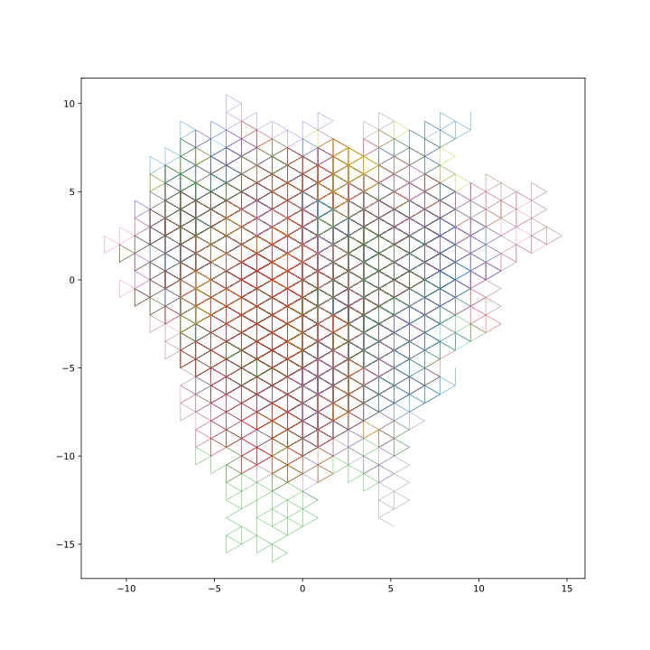
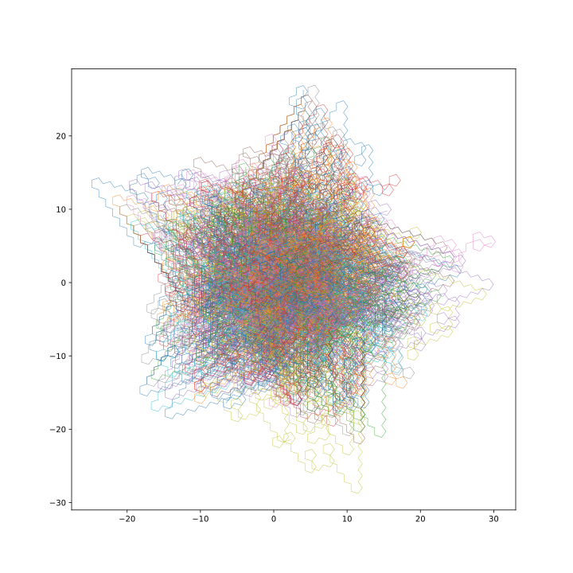

## collatz-conjecture project 콜라흐 추측

dataset link [hugging face](https://huggingface.co/datasets/Taery/Collatz_conjecture_100m) | graph, etc [site](https://polite-bush-02da9d200.1.azurestaticapps.net/)
 
 

